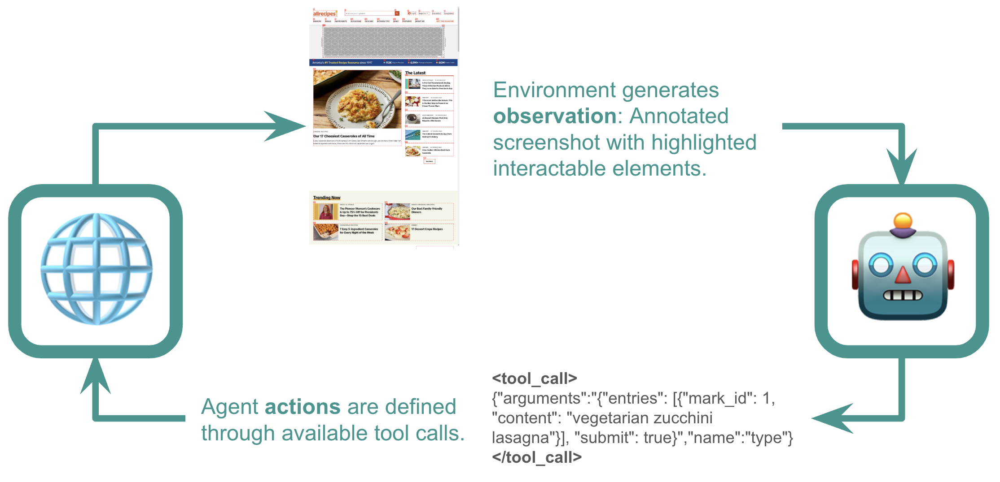

<div align="center">

  

  <h2>
    A mini, open-weights, version of <a href="https://proxy.convergence.ai">Proxy</a>.
  </h2>


<!-- Badges -->
<p>
  <a href="https://github.com/convergence-ai/proxy-lite/contributors">
    
  </a>
  <a href="">
    
  </a>
  <a href="https://github.com/convergence-ai/proxy-lite/network/members">
    
  </a>
  <a href="https://github.com/convergence-ai/proxy-lite/stargazers">
    
  </a>
  <a href="https://github.com/convergence-ai/proxy-lite/issues/">
    
  </a>
</p>

</div>


<div align="center">
     
</div>


## Installation

Clone the repository: 

```bash
git clone https://github.com/convergence-ai/proxy-lite.git
```

Set-up the environment with:

```bash
make proxy
```

Or do it manually:

```bash
pip install uv
uv venv --python 3.11 --python-preference managed
uv sync
uv pip install -e .
playwright install
```


## Usage

```bash
proxy --help
```
You can directly run Proxy Lite on a task with:

```bash
proxy "Find some markets near Kings Cross and tell me their ratings."
```

Alternatively you can run the local web ui with:

```bash
make app
```

### Proxy Lite Endpoint

By default, Proxy Lite will point to an endpoint set up on HuggingFace spaces.
> ❗ This is a demo endpoint and is not suitable for production, or even frequent hobbyist, use; it may be very slow when under even moderate load.

We recommend hosting your own endpoint with vLLM, you can use the following command:

```bash
vllm serve --model convergence-ai/proxy-lite-3b \
    --trust-remote-code \
    --enable-auto-tool-choice \
    --tool-call-parser hermes \
    --port 8008 \
```

The tool arguments are **very important** for parsing the tool calls from the model appropriately.

> **Important:** To serve the model locally, install vLLM and transformers with `uv sync --all-extras`. Qwen-2.5-VL support is not yet available in the latest release of `transformers` so installation from source is required (the appropriate revision is specified in the `pyproject.toml` file).

You can set the `api_base` to point to your local endpoint when calling Proxy Lite:

```bash
proxy --api-base http://localhost:8008/v1 "Book a table...
```
or by setting the environment variable:

```bash
export PROXY_LITE_API_BASE=http://localhost:8008/v1
```

## Scaffolding Proxy Lite in Python

If using the model outside the CLI or streamlit app, you can use the `Runner` class to launch the model in a web-browsing environment.

The `RunnerConfig` is how you configure the system setup, including the model used.
The library is designed to be modular and extendable, making it easy to swap out the environment, solver, or agent.

Example:
```python
import asyncio
from proxy_lite import Runner, RunnerConfig

config = RunnerConfig.from_dict(
    {
        "environment": {
            "name": "webbrowser",
            "homepage": "https://www.google.com",
            "headless": True, # Don't show the browser
        },
        "solver": {
            "name": "simple",
            "agent": {
                "name": "proxy_lite",
                "client": {
                    "name": "convergence",
                    "model_id": "convergence-ai/proxy-lite-3b",
                    "api_base": "https://convergence-ai-demo-api.hf.space/v1",
                },
            },
        },
        "max_steps": 50,
        "action_timeout": 1800,
        "environment_timeout": 1800,
        "task_timeout": 18000,
        "logger_level": "DEBUG",
    },
)

proxy = Runner(config=config)
result = asyncio.run(
    proxy.run("Book a table for 2 at an Italian restaurant in Kings Cross tonight at 7pm.")
)
```

The `Runner` sets the solver and environment off in a loop, like in a traditional reinforcement learning setup.

<div align="center">
  
</div>


Proxy Lite expects the following message format:

```python
message_history = [
    {
        "role": "system", 
        "content": "You are Proxy Lite...", # Full system prompt in src/proxy_lite/agents/proxy_lite_agent.py
    }, # System prompt
    {
        "role": "user", 
        "content": "Find some markets near Kings Cross and tell me their ratings.",
    }, # Set the task
    {
        "role": "user", 
        "content": [
            {"type": "image_url", "image_url": {base64_encoded_screenshot} },
            {"type": "text", "text": "URL: https://www.google.com/ \n- [0] <a>About</a> \n- [1] <a>Store</a>...."}
        ] # This is the observation from the environment
    },
]
```
This would then build up the message history, alternating between the assistant (who takes the *action*) and the user (who provides the *observation*).

> **Context-Window Management:** When making calls to the model, all the observations other than the current one are discarded in order to reduce the large number of image tokens required. Since the model responses include reflection on the observations and are all included in the message history, the model is still aware of the entire history when planning new actions.

You should also pass the `Tools` that the model has access to, these will define the action space available to the model. You can do this with `transformers`:

```python
from qwen_vl_utils import process_vision_info
from transformers import AutoProcessor

from proxy_lite.tools import ReturnValueTool, BrowserTool
from proxy_lite.serializer import OpenAICompatableSerializer

processor = AutoProcessor.from_pretrained("convergence-ai/proxy-lite-3b")
tools = OpenAICompatableSerializer().serialize_tools([ReturnValueTool(), BrowserTool(session=None)])

templated_messages = processor.apply_chat_template(
    message_history, tokenize=False, add_generation_prompt=True, tools=tools
)

image_inputs, video_inputs = process_vision_info(message_history)

batch = processor(
    text=[templated_messages],
    images=image_inputs,
    videos=video_inputs,
    padding=True,
    return_tensors="pt",
)
```

Or you can send to the endpoint directly, which will handle the formatting:

```python
from openai import OpenAI

client = OpenAI(base_url="http://convergence-ai-demo-api.hf.space/v1")

response = client.chat.completions.create(
    model="convergence-ai/proxy-lite-3b",
    messages=message_history,
    tools=tools,
    tool_choice="auto",
)
```

The model's response will follow the format of:
- Observe
- Think
- Act
```bash
<observation>The privacy consent banner has been successfully dismissed, allowing full access to the webpage. The search bar is visible, and the page is ready for interaction.</observation>
<thinking>The task of finding a vegetarian lasagna recipe has not yet been completed. I now have access to the search bar to begin searching for the recipe. I will type 'vegetarian lasagna' into the search bar and then click the search button to find relevant recipes.</thinking>
<tool_call>{"function": "click", "arguments": {"entries": [{"mark_id": 1, "content": "vegetarian lasagna"}]}}</tool_call>
```
Where steps are separated by `<observation>`, `<thinking>`, and `<tool_call>` tags (Use the `-tool-call-parser hermes` option with the vLLM server to automatically parse the tool call when getting back the completion).


### Webbrowser Environment

The `webbrowser` environment is a simple environment that uses the `playwright` library to navigate the web.

We launch a Chromium browser and navigate to the `homepage` provided in the `RunnerConfig`.

Actions in an environment are defined through available tool calls, which in the browser case are set as default in the `BrowserTool` class. This allows the model to click, type, etc. at relevant `mark_id` elements on the page. These elements are extracted using JavaScript injected into the page in order to make interaction easier for the models. 

**Note:** We use `playwright_stealth` to lower the chance of detection by anti-bot services, but this isn't foolproof and Proxy Lite may still get blocked by captchas or other anti-bot measures, especially when using the `headless` flag. We recommend using network proxies to avoid this issue.


## Limitations

This model has not been designed to act as a full assistant able to interact with a user, instead it acts as a tool that goes out and *autonomously* completes a task.
As such, it will struggle with tasks that require credentials or user interaction such as actually purchasing items if you don't give all the required details in the prompt.

## Try Proxy

Want to try out the full version of Proxy? Visit [proxy.convergence.ai](https://proxy.convergence.ai) to experience the complete, production-ready autonomous assistant with enhanced capabilities, improved reliability, and support for a wider range of tasks.


## Citation

```bibtex
@article{proxy-lite,
  title={Proxy Lite - A Mini, Open-weights, Autonomous Assistant},
  author={Convergence AI},
  url={https://github.com/convergence-ai/proxy-lite},
  year={2025}
}
```